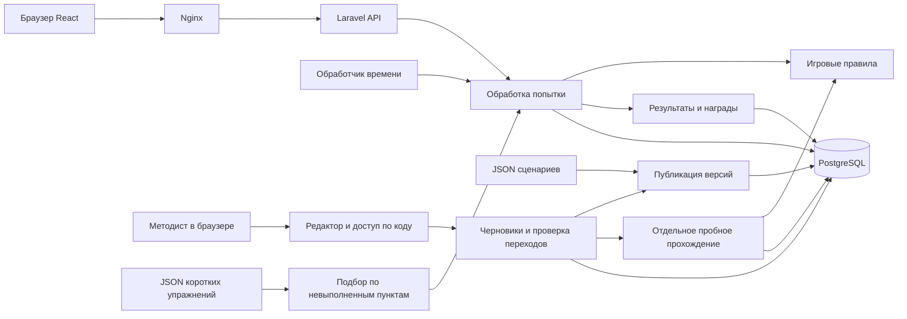
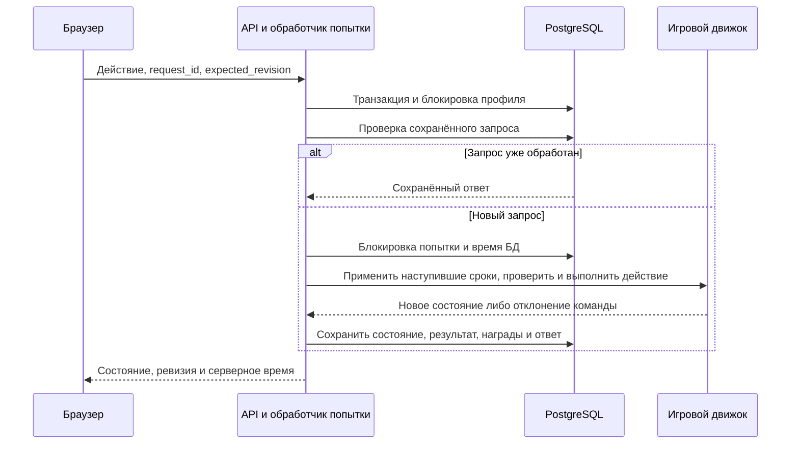

# Устройство тренажёра

`Engine` не обращается к HTTP, Laravel или базе. Он получает состояние, сценарий и время. `AttemptService` отвечает за блокировки, повторные запросы и сохранение. `Progress` считает лучшие результаты и награды. Контроллер принимает и проверяет HTTP-поля.

Профиль блокируется раньше попытки. Поэтому два запроса одного профиля и обработчик времени не могут одновременно начислить награду. Уникальные ограничения дополнительно защищают лучший результат, достижение, участие, бонус и уведомление.

Состояние и версия попытки сохраняются в PostgreSQL. Дедлайны не хранятся только в памяти процесса. Клиент отображает остаток, но решение о просрочке всегда принимает сервер.

Упражнение хранит исходную попытку и снимок собственного содержания. Его результат не поступает в рейтинги, компетенции, испытание и экспорт полных смен. Подбор и сравнение описаны в [practice.md](practice.md). Версия приложения до добавления упражнений не подходит для отката после появления таких записей: нужно сохранить поддержку новых данных и фильтрацию результатов.

## Пример для защиты

В первой смене действие `apologize` назначает скрытое появление багажа через 20 секунд. `Engine::expire` открывает обращение и устанавливает срок на 45 секунд от планового появления. Вторая цепочка развивается независимо от диалога о розетке. Нажатие кнопки после дедлайна сначала фиксирует просрочку, затем получает конфликт ревизии с актуальным состоянием.

Чтобы изменить сценарий, скопируйте его JSON, увеличьте `version`, измените текст или действие, опубликуйте командой `scenario:publish`. Предыдущая версия и её результаты сохранятся; новая будет доступна в обучении. Для проверки рейтинга продолжают использоваться две закреплённые версии.

## Возврат предыдущей сборки

До обновления сохраните текущие Git-ревизию и образы приложения. Возврат выполняется заменой сборки API и интерфейса, с сохранением тома PostgreSQL и `.env`. Миграция точности времени совместима с предыдущим кодом; обратное округление исторических результатов запрещено и её `down()` завершается явной ошибкой. При ошибке подготовки init не допускает запуск новой API-службы. Для развёртывания на другой машине резервную копию БД нужно подготовить отдельно; локальные проверки не проверяют инфраструктуру перевозчика.

Редактор хранит черновики отдельно от опубликованного каталога. `DraftContent` проверяет форму данных, `EditorValidator` — допустимые операции и достижимость завершений, `EditorService` — владельца и ревизию. `PreviewService` использует общий движок с отдельным состоянием. Публикация защищена общей блокировкой каталога; рейтинг не принимает новые учебные версии.
