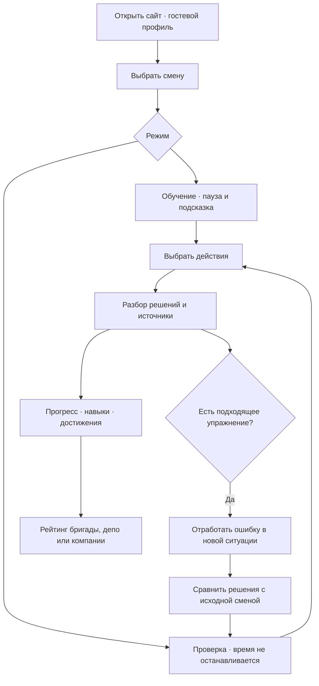

# Путь игрока

В «Сервисе и свободном проходе» пассажир сообщает о неисправной розетке. После первого ответа через 20 секунд появляется багаж в проходе. Игрок переключается между обращениями, сохраняя сроки каждого события. Нужно помочь пассажиру, сообщить ответственным и освободить проход за 45 секунд. Наличие свободного места выбирается в обучении; в проверке место есть.

В «Похожей вещи — другом решении» владелец багажа не установлен. За 35 секунд нужно передать сообщение ответственным; вещь перемещать нельзя. Предупреждение пассажиров также обязательно. Критическая ошибка завершает смену незачётом, независимо от лояльности.

Например, после перемещения вещи разбор показывает нарушение и предлагает упражнение «Чья это вещь?». В новой ситуации сумка стоит рядом с пассажиром, который говорит, что она не его. После двух правильных решений игрок видит сравнение и может пройти самостоятельную проверку полной смены. Упражнение не меняет прежнюю оценку и не приносит рейтинговых баллов.

Перезагрузка страницы возвращает незавершённое прохождение. Пауза доступна только в обучении. В проверке закрытие вкладки не останавливает время. Прогресс привязан к гостевой сессии браузера; входа по учётной записи пока нет.

Сроки, штрафы и допустимые последовательности — настройки учебной модели. Основания решений приведены в разборе, предметные допущения — в ТЗ.
